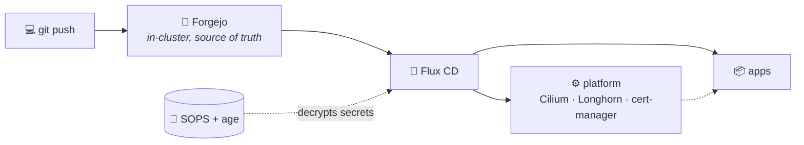

 

  

### 🔨 Currently building

**[wisp](https://github.com/antoniosarro/wisp)**: a small, fast coding-agent harness for your terminal, built for local models. 
Works with any OpenAI-compatible endpoint (llama.cpp, vLLM, Ollama, LM Studio, OpenRouter). It's a single static Go binary.

&nbsp;&nbsp;

### 🏠 Homelab

A bare-metal **Kubernetes** cluster on **Talos Linux**, run entirely through GitOps. I `git push`, and
**Flux** reconciles the cluster to match. No SSH, no clicking around, no snowflake servers.

  
  
  
  
  
  
  
  
  

#### 🔁 How it works

#### 🖥️ The nodes

| Node | Hardware | Role |
| --- | --- | --- |
| 🔭 **orion** | i7-7700 · 32 GB · NVMe | workhorse: databases and heavy storage |
| 🎻 **lyra** | i5-6500 · 16 GB · SSD | general workloads *(joining soon)* |
| 🐦 **corvus** | Raspberry Pi 4 · 8 GB · arm64 | edge node *(joining soon)* |

#### ⚙️ The platform

| | |
| --- | --- |
| 🌐 **Networking** | Cilium with Gateway API in front of every app · Let's Encrypt wildcard TLS via cert-manager · OPNsense firewall with VLANs at the edge |
| 💾 **Storage** | Longhorn volumes replicated across the Intel nodes · nightly backups |
| 🔐 **Secrets** | Committed to git, encrypted with SOPS + age, decrypted in-cluster by Flux |
| 🧩 **New apps** | Scaffolded from a template with one `just` command, then validated before every push |

<b>📦 What's running</b>

 

| | Services |
| --- | --- |
| 🛠️ **Dev** | Forgejo + CI runner |
| 🔐 **Security** | Vaultwarden |
| 🌐 **Network** | AdGuard Home · Caddy · Cloudflare DDNS |
| 📝 **Productivity** | AFFiNE · Memos · Linkding · Excalidraw · Homebox · Actual Budget · Stirling PDF · IT-Tools |
| 📊 **Dashboards & alerts** | Glance · Gotify |
| 🚀 **Web** | my personal site, self-hosted |

### ❄️ Nix everywhere

My desktop and laptop are built from **one NixOS flake**: the same modules, the same shell, the same
look, and every change is checked before it lands.

| | |
| --- | --- |
| 🖥️ **Machines** | Desktop (RTX 4070 Ti) and laptop, each on btrfs inside LUKS, partitioned declaratively with disko |
| 🧱 **Structure** | A `core` + `optional` split for both NixOS and home-manager: each host picks only the modules it needs. Hosts and custom packages are discovered automatically |
| 🪟 **Desktop** | Hyprland · Waybar · Rofi · greetd · kitty, with my own packaged Bibata Amber cursor |
| 🐚 **Shell** | zsh · starship · tmux · fzf · zoxide · eza · bat · lazygit · neovim, identical on every machine |
| 🔐 **Secrets** | sops-nix with age keys, so nothing sensitive is stored in plaintext |
| 🐳 **Virtualisation** | Docker · libvirt + virt-manager with TPM emulation · Waydroid |
| 🎮 **Gaming** | Steam with a gamescope session and gamemode |
| 🔭 **Astrophotography** | GraXpert, ASTAP and StarNet2, packaged myself because they aren't in nixpkgs |
| ✅ **Quality gates** | Eval checks, `nixfmt-rfc-style`, bats tests and pre-commit hooks, including private-key detection |

#### 🤖 Local AI stack

A **llama.cpp + llama-swap** backend serves a whole roster of models behind a single OpenAI-compatible
endpoint, hot-swapping whichever one is requested on 12 GB of VRAM:

- **Coding & homelab:** Qwen3.6-35B-A3B, a MoE model that runs at ~42 tok/s even with its weights offloaded to RAM
- **Writing & summaries:** Gemma 4 12B
- **Logs & structured work:** Granite 8B
- **Quick sub-agents:** small, fast 4B to 8B models for high-frequency loops

Each task gets its own agent role (homelab, NixOS, logs and more), all driven by
[wisp](https://github.com/antoniosarro/wisp).

### ✍️ Latest from the blog

<!-- BLOG-POST-LIST:START -->
- [Self-Hosted Container Management with Komodo: Your Own Deployment Platform in Docker](https://antoniosarro.dev/blog/komodo-homelab)
- [Self-Hosted Git with Forgejo: Your Own GitHub Alternative in Docker](https://antoniosarro.dev/blog/forgejo-homelab)
- [Building a High-Performance Portfolio with SvelteKit: A Deep Dive](https://antoniosarro.dev/blog/building-portfolio)
- [The Opinion Factory: When Everyone's Voice Becomes No One's Wisdom](https://antoniosarro.dev/blog/opinion-factory)
<!-- BLOG-POST-LIST:END -->

### 📈 Activity

  

<picture>
  <source media="(prefers-color-scheme: dark)" srcset="https://raw.githubusercontent.com/antoniosarro/antoniosarro/output/snake-dark.svg">
  
</picture>

